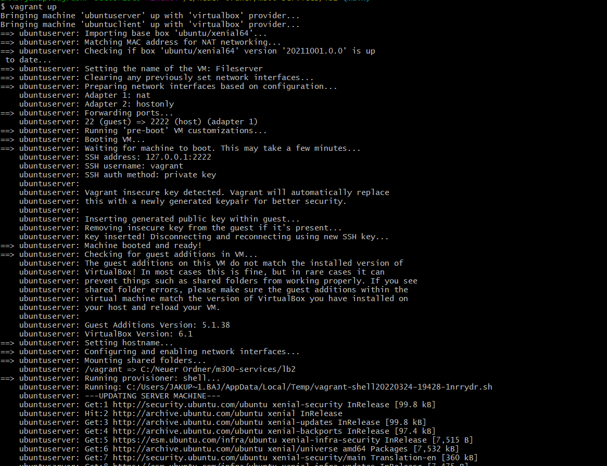
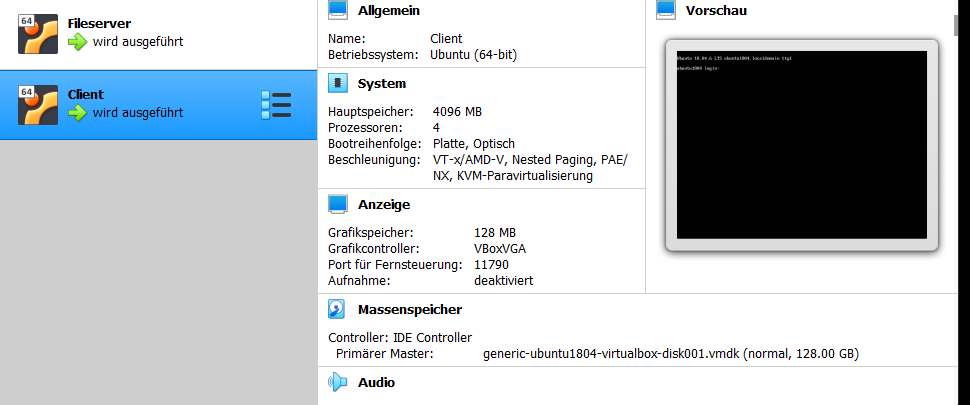
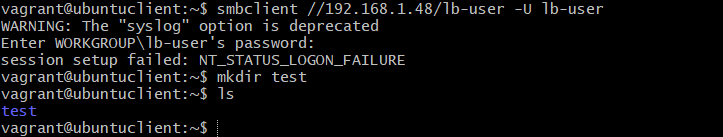
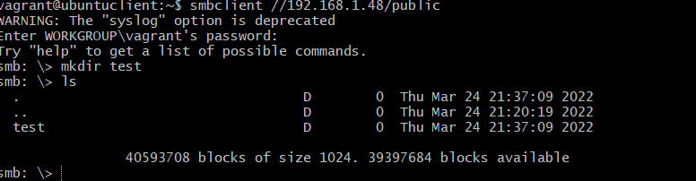

# Inahltsverzeichnis
 1. [Einleitung](#Einleitung)
 
 1. [Umgebung](#Umgebung) 

 2. [Erklärung Code](#Erklärung)

 3. [Testing](#Testing)


<div id='Einleitung'/>

# Einleitung
In diesem LB2 von Modul 300 (Integration von plattformübergreifenden Diensten in das Netzwerk) werfen wir einen Blick auf Vagrant. Wir verwenden Markdown, um Dokumentation zu schreiben. Das Ziel von LB2 ist es, mit Vagrant eine Dienstfunktion mit mehreren VMs oder Diensten aufzubauen. In unserem Fall richten wir zwei VMs ein. Der Servercomputer des SMB-Dateiservers und die Clients, die darauf zugreifen können. Dieser Dienst ermöglicht es Geräten innerhalb des Netzwerks, auf freigegebene Dateien zuzugreifen und Berechtigungen für Ordner/Dateien zu steuern.

<div id='Umgebung'/>

# Umgebung


### Shares
- **LB-User Share:**
Nur der Benutzer lb-user kann auf diese Freigabe zugreifen. Dazu benötigen Sie ihren Benutzernamen und ihr Passwort, während allen anderen der Zugriff verweigert wird. In dieser Freigabe kann nur der lb-Benutzer Dateien erstellen und löschen und hat vollen Zugriff auf die Freigabe.
> **Hinweis:** Benutzername und Passwort werden bereitgestellt

- **Public Share:**
Jeder kann auf diese Freigabe zugreifen. Hier ist kein Konto erforderlich, jeder hat das Recht, Dateien und Ordner in dieser Freigabe zu löschen

<div id='Erklärung'/>

# Erklärung Code


Im Vagrant file erstellen wir die VMs und geben die Spezifikationen durch. Folgende sachen werden an hier angegeben  VM Configs / Network Configs 

| Hardware   |      Konfiguration     |
|:----------|:-------------|
| CPU |  2x Core|
| RAM |    2048  |
| Netzwerkkarte fileserver| 192.168.1.48|
| Netzwerkkarte Client| 192.168.1.50 |


VM1
```ruby
Vagrant.configure("2") do |config|

  # Fileserver
  config.vm.define "ubuntuserver" do |fileserver|
    fileserver.vm.hostname = "ubuntuserver"
    fileserver.vm.box = "ubuntu/xenial64"
    
    # Network Configs
    fileserver.vm.network "private_network", ip: "192.168.1.48"

    # VM Configs
    fileserver.vm.provider "virtualbox" do |vb|
      vb.gui = false
      vb.name = "Fileserver"

      # VM Specs
      vb.memory = "2048"
      vb.cpus = "2"
    end

    # Provision Script
    fileserver.vm.provision "shell", path: "provision/serverdeployment.sh"
  end
```
VM2

```ruby
  # Client VM
  config.vm.define "ubuntuclient" do |client|
    client.vm.hostname = "ubuntuclient"
    client.vm.box = "generic/ubuntu1804"

    # Network Configs
    client.vm.network "private_network", ip: "192.168.10.10"

    # VM Configs
    client.vm.provider "virtualbox" do |vb|
      vb.gui = false
      vb.name = "LB-Client"
      
      # VM Specs
      vb.memory = "4096"
      vb.cpus = "4"
      vb.customize ["modifyvm", :id, "--vram", "128"]
    end

    # Provision Script
    client.vm.provision "shell", path: "provision/clientdeployment.sh"
  end

end
  end
```


<div id='Testing'/>

# Testing


<a name="hochfahren"></a>
### Hochfahren:

Um die Umgebung hoch zufahren, muss man im Terminal im **gleichen Ordner wie das Vagrantfile** sein und **vagrant up** eingeben. Dies dauert eine Weile, da es die Nötigen Daten herunterladet und die VMs erstellt und konfiguriert.

<a name="herunterfahren"></a>
### Herunterfahren:

Wenn man nun die Umgebung herunterfahren möchte, muss man im Terminal im **gleichen Ordner wie das Vagrantfile** sein und **vagrant halt** eingeben.

<a name="umgebung-löschen"></a>
### Umgebung vom Gerät löschen:

Um die Umgebung vom Gerät nun zu löschen, muss man im Terminal im **gleichen Ordner wie das Vagrantfile** sein und den Befehl **vagrant destroy** eingeben. 
> **NOTE:** Man muss bei den Maschinen die beide Male **"y"** eingeben, um zu bestätigen, dass man die VMs auch wirklich löschen will.

<a name="befehl-tabelle-vagrant"></a>

### Befehl-Tabelle Vagrant:

|Befehl    |Command (im Terminal)                    |
|-------------------------|--------------------------|
|hochfahren / erstellen   |`vagrant up`              |
|herunterfahren           |`vagrant halt`            |
|löschen                  |`vagrant destroy`         |

Ausführung Vagrant UP


überprüfung erstellte VMs auf Virtualbox


<a name="via-ssh-auf-die-vms-zugreifen"></a> 
## Via SSH auf die VMs zugreifen:

Um auf die einzelnen VMs zuzugreifen, muss man lediglich im Terminal im **gleichen Ordner wie das Vagrantfile** sein und den Befehl **vagrant ssh "Maschine"** eingeben.

|Welche Maschine  |Command (im Terminal)              |
|-----------------|-----------------------------------|
|Fileserver       |`vagrant ssh ubuntuserver`         |
|Client           |`vagrant ssh ubuntuclient`         |

<a name="benutzernamen-und-passwoerter"></a>
## Benutzernamen und Passwörter

<a name="ssh"></a>
### SSH

Auf dem LB-Fileserver sowie auf dem LB-Client sind die SSH User Vagrant.
- Benutzername: vagrant
- Passwort: vagrant

<a name="samba"></a>
### SAMBA

Um auf den privaten Samba Share zugreifen zu können, braucht es einen privaten Benutzer: "lb-user"
- Benutzername: lb-user
- Passwort: password 

<a name="zugreifen-auf-den-privaten-share"></a>
## Zugreifen auf den privaten Share

Zugreifen auf den Samba Share via Ubuntuclient Terminal:

|welcher Share    |Command (im Terminal)                                    |
|-----------------|---------------------------------------------------------|
|privaten Share   |`smbclient //192.168.1.48/lb-user -U lb-user`              |
|public Share     |`smbclient //192.168.1.48/public`                        |
|Allgemein        |`smbclient //*IP Adresse*/*Ordner* -U *Benutzername*`    |

Testing vom Private Share



Testing vom Public Share


## Ordner erstellen und anzeigen
Wenn wir Zugriff auf die Shares haben, können wir nun darauf Dateien und Ordner erstellen.

<a name="exit"></a>
## Exit

### Aus Sambashare

Um den Share zu verlassen, in welchen man sich eingeloggt hat, muss man nur einen Befehl eingeben:
> exit

### Aus SSH

Um die SSH Verbindung (im Terminal von z.B. Visual Studio Code,...) zu trennen, muss man lediglich einen Befehl eingeben:
> exit
