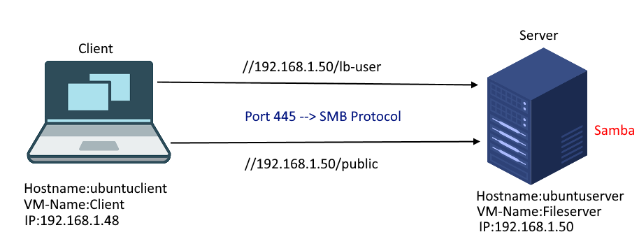

# Inahltsverzeichnis
 1. [Einleitung](#Einleitung)
 
 1. [Umgebung](#Umgebung) 

 2. [Erklärung Code](#Erklärung)

 3. [Testing](#Testing)

 4. [Quellenagabe](#quellenangabe)


<div id='Einleitung'/>

# Einleitung


<div id='Umgebung'/>

# Umgebung



<div id='Erklärung'/>

# Erklärung Code


Im Vagrant file erstellen wir die VMs und geben die Spezifikationen durch. Folgende sachen werden an hier angegeben  VM Configs / Network Configs 

| Hardware   |      Konfiguration     |
|:----------|:-------------|
| CPU |  2x Core|
| RAM |    2048  |
| Netzwerkkarte fileserver| 192.168.1.48|
| Netzwerkkarte Client| 192.168.1.50 |


VM1
```ruby
Vagrant.configure("2") do |config|

  # Fileserver
  config.vm.define "ubuntuserver" do |fileserver|
    fileserver.vm.hostname = "ubuntuserver"
    fileserver.vm.box = "ubuntu/xenial64"
    
    # Network Configs
    fileserver.vm.network "private_network", ip: "192.168.1.48"

    # VM Configs
    fileserver.vm.provider "virtualbox" do |vb|
      vb.gui = false
      vb.name = "Fileserver"

      # VM Specs
      vb.memory = "2048"
      vb.cpus = "2"
    end

    # Provision Script
    fileserver.vm.provision "shell", path: "provision/serverdeployment.sh"
  end
```
VM2

```ruby
  # Client VM
  config.vm.define "ubuntuclient" do |client|
    client.vm.hostname = "ubuntuclient"
    client.vm.box = "generic/ubuntu1804"

    # Network Configs
    client.vm.network "private_network", ip: "192.168.10.10"

    # VM Configs
    client.vm.provider "virtualbox" do |vb|
      vb.gui = false
      vb.name = "LB-Client"
      
      # VM Specs
      vb.memory = "4096"
      vb.cpus = "4"
      vb.customize ["modifyvm", :id, "--vram", "128"]
    end

    # Provision Script
    client.vm.provision "shell", path: "provision/clientdeployment.sh"
  end

end
  end
```


<div id='Testing'/>

# Testing
